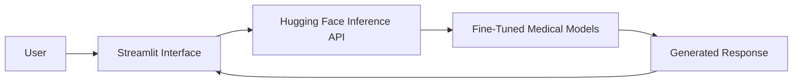

# Medical AI Chat Interface for Fine Tuned Language Models

This project is an academic demonstration of integrating multiple **fine tuned Large Language Models (LLMs)** into a single interactive chat interface. Developed using **Streamlit** and the **Hugging Face Inference API**, the application enables users to evaluate and compare responses generated by custom models fine tuned on medical and mental health datasets.

The primary objective of this project was to explore the end to end workflow of **LLM fine tuning, model hosting and inference**, while providing a simple interface for testing and comparing specialized models.

> **Built with:** Python • Streamlit • Hugging Face Inference API • Transformers

---

## Project Overview

Large Language Models can be adapted to specialized domains through fine tuning on domain specific datasets. In this project, multiple open source language models were fine tuned for medical and mental health tasks and integrated into a unified interface for evaluation.

Rather than serving as a production chatbot, this application was developed for **academic and research purposes** to demonstrate how fine tuned language models can be deployed through an inference API and accessed using a lightweight web interface.

---

## Project Objectives

The project was designed to:

- Explore the fine-tuning workflow for domain specific language models.
- Integrate multiple fine tuned models into a single application.
- Compare responses generated by different models.
- Demonstrate inference using the Hugging Face Inference API.
- Provide a simple interface for testing and evaluating model outputs.

---

## Features

- Interactive chat interface built with Streamlit.
- Selection between multiple fine tuned language models.
- AI generated responses using the Hugging Face Inference API.
- Session based conversation history.
- Download chat responses as text files.
- User friendly interface for comparing model outputs.
- Error handling for failed API requests.

---

# System Architecture



---

# How It Works

1. The user selects one of the available fine tuned language models.
2. A prompt is entered through the Streamlit interface.
3. The application sends the prompt to the selected model using the Hugging Face Inference API.
4. The fine tuned model generates a response.
5. The response is displayed in the chat interface and stored in the current session history.

---

# Fine-Tuned Models

The following models were developed as part of this project and published on Hugging Face.

| Model | Domain | Description |
|--------|--------|-------------|
| Llama-3.2-1B LoRA Fine Tune | Medical | Fine tuned for answering general medical questions. |
| Gemma Mental Health Fine Tune | Mental Health | Fine tuned for mental health and well being related conversations. |
| Qwen-1.5B Medical QA | Medical QA | Fine tuned for medical question answering tasks. |

---

# Project Structure

```text
medical-ai-chat/

├── app.py
├── requirements.txt
├── assets/
├── screenshots/
├── models/
├── README.md
└── ...
```

---

# Tech Stack

| Category | Technology |
|-----------|------------|
| Language | Python |
| Frontend | Streamlit |
| Model Hosting | Hugging Face Hub |
| Inference | Hugging Face Inference API |
| LLM Framework | Transformers |
| API Communication | Requests |

---

# Installation

## Clone the Repository

```bash
git clone https://github.com/yourusername/medical-ai-chat-interface.git

cd medical-ai-chat-interface
```

---

## Create a Virtual Environment

```bash
python -m venv venv
```

Windows

```bash
venv\Scripts\activate
```

Linux / macOS

```bash
source venv/bin/activate
```

---

## Install Dependencies

```bash
pip install -r requirements.txt
```

---

## Configure Environment Variables

Create a `.env` file in the project root.

```env
HF_API_KEY=YOUR_HUGGING_FACE_API_KEY
```

---

## Run the Application

```bash
streamlit run app.py
```

---

# Workflow

```text
User Prompt
      │
      ▼
Select Fine Tuned Model
      │
      ▼
Hugging Face Inference API
      │
      ▼
Model Inference
      │
      ▼
Generated Response
      │
      ▼
Displayed in Streamlit Interface
```

---

# Academic Purpose

This project was developed as part of an academic exploration of **Large Language Model fine tuning and inference**. It demonstrates how custom trained models can be integrated into a lightweight application for experimentation and evaluation.

The project is intended for educational and research purposes and should not be considered a production-ready medical assistant or a source of professional medical advice.

---

# Future Improvements

- Support additional fine tuned language models.
- Local inference without external APIs.
- Streaming response generation.
- Response evaluation metrics.
- Conversation export in multiple formats.
- Retrieval Augmented Generation (RAG) integration.
- Deployment using containerized infrastructure.

---

# License

This project is licensed under the MIT License.
